# The Wisdom Trial
---
## Site Overview
----
"The Wisdom Trial" is an engaging general knowledge quiz that celebrates the profound symbolism of books as vessels of wisdom and enlightenment.

The project incorporates this symbolism into its design. The hero image, font selection, and background transport the users into an ancient tome, instilling a sense of timeless knowledge exploration.

Driven by the developer's deep passion for fantasy, the entire project exudes a captivating fantasy-themed aesthetic, adding a layer of enchantment to the experience.

Participants can expect questions in six subjects: Science, Geography, History, Literature, Entertainment and Sport. 
Upon completing the quiz, a table summarizes the results. Moreover, a radar plot visually showcases the user's proficiency across the various subjects, providing a comprehensive overview of their knowledge strengths and areas for improvement.

Behind the scenes, the JavaScript algorithm powers the quiz, offering robustness and scalability. The project allows adding questions to the `questions.js` file, and categories can be modified or expanded by editing the `categories` variable in the `script.js` file. 

The project follows a mobile-first approach. Nevertheless, it scales seamlessly on various screen sizes, including mobiles (small, medium, and large), tablets, and laptops (medium, large, and 4k).  

 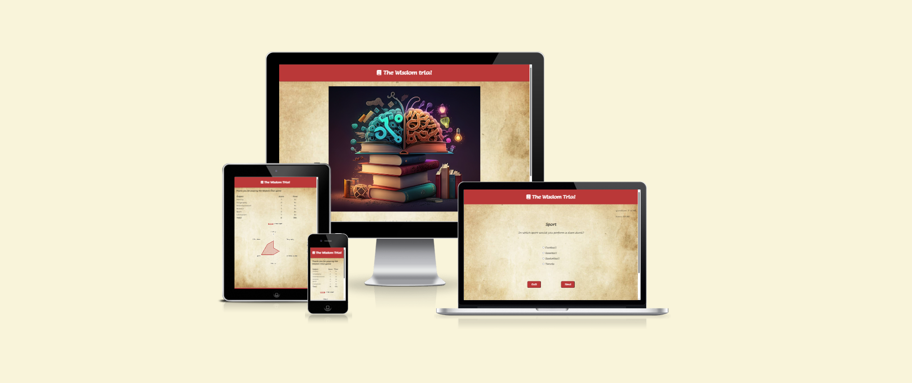

## Table of contents:
---
- [The Wisdom trial](#the-wisdom-trial)
    - [Site Overview](#site-overview)
- [Target audience](#target-audience)
    - [Aims](#aims)
    - [Goals achieved](#goals-achieved)
- [Typography](#typography)
- [Current Features](#current-features)
    - [Header element](#header-element)
    - [Hero image](#hero-image)
    - [Intro](#intro)
    - [Counters](#counters)
    - [Question](#question)
    - [Buttons](#buttons)
    - [Result table](#result-table)
    - [Radar Plot](#radar-plot)
- [Bugs Fixing](#bugs-fixing)
- [Future developments](#future-developments)
- [How to add questions and categories](#how-to-add-questions-and-categories)
- [Testing](#testing)
- [Validators score](#validators)
- [Deployment](#deployment)
- [Credits](#credits) 


## Target audience
---
- Students who want to challenge themselves to determine the subjects they excel with.
- Adults who want to assess their knowledge in different subjects.
- Users seeking an entertaining quiz night with friends or during events.

### Aims
1. Create a quiz game for users to challenge themselves.
2. Develop a robust framework for quiz games that easily accommodates changes and additions to questions and categories.
3. Showcase users' strengths in various subjects.
4. Provide an enjoyable and user-friendly distraction.
---

### Goals achieved: 
1. Developed a quiz game with 30 questions divided into six categories.
2. Created a `questions.js` file to facilitate the editing of questions and answers.
3. Displayed a table at the end of the game, showing the user's scores and time spent in each category, highlighting their strengths.
4. Designed the game to be playable on various screen sizes, including mobiles, tablets, and laptops.

### Typography 
---
- Imported fonts using Google Fonts.
- The chosen font is "Lumanosimo" to evoke the feeling of reading an ancient tome. Initially, the developer added the font "Medieval Sharp", but the use of "Lumanosimo"  only was more visually appealing.

## Current Features
---
### Header Element
The header includes the page title and a link to the home page.
Thus, the users can return to the home page during the quiz or from the result page.


### Hero image
The hero image represents an ancient book, which inspired the style of the entire project.
Indeed, the cosy feeling returned by the picture and the red tone inspired the developer to style the project accordingly.
The developer decided to give the user the feeling of reading one of the books in the pile.


### Intro
A brief introduction informs users about the project's purpose and how to start the game. It also includes the "Start Quiz" button, initiating the game when clicked.


### Counters
The question page displays a counter showing the number of questions answered and the number of the remaining. It also features a timer that resets with each new question. 
Thus,  at the end of the quiz, the user can also visualize the category where he replied faster.
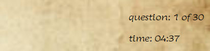

### Question
The question section presents the question category, the question itself, and a list of answer choices. Users can select the correct answer by clicking the radio button.
The developer wrote the questions as broadly as possible, covering different topics within the same category.
Furthermore, the quiz selects a question randomly from a pool, ensuring a different questions order at each match.
The above also simplifies a possible extension of the questions pool. 
For example, if a developer adds more questions, the quiz will show only five random questions per category.
Therefore, the quiz could display new questions to the user at each game.
  

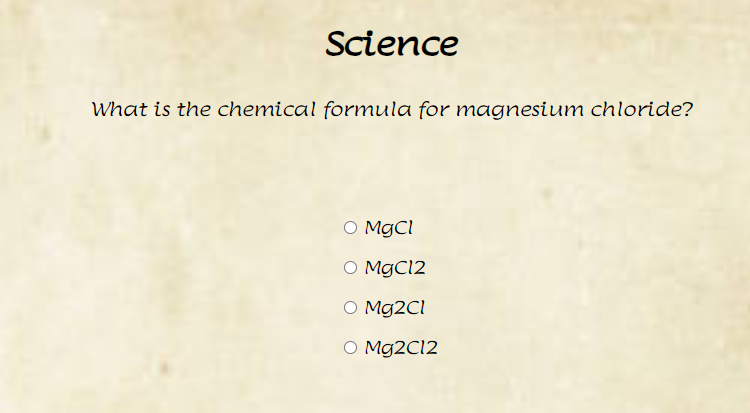

### Buttons
The buttons section includes two options: "Next" and "Exit." Users can move to the next question by clicking the "Next" button after selecting the answer via the radio button. Alternatively, pressing the Enter key on the keyboard after selecting the option will also advance to the next question. Clicking the "Exit" button prompts a message asking if the user wants to continue the game or leave the page. Selecting "Yes" returns the user to the home page, while selecting "No" allows them to continue the game.
The exit button provides a more intuitive and guided method to return to the home page if compared to the header element. 
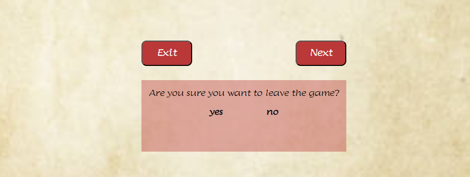


### Result table
The results table section thanks the player for participating in the game and displays the time (in seconds) and score obtained in each category. It also shows the total score and time.
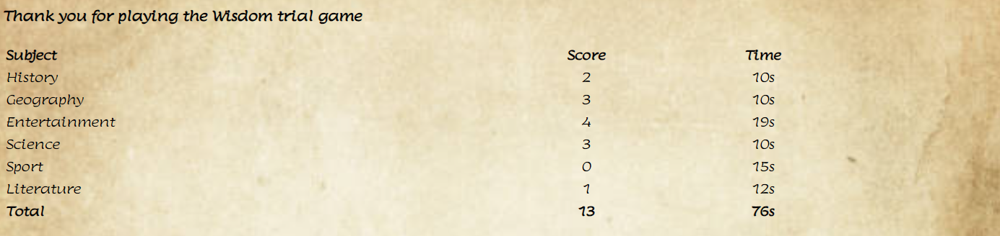

### Radar Plot
The results page includes a radar plot representing the user's scores in various subjects. 
The developer chose the radar plot because it provides the user with a graphical representation of his proficiencies.
The radar plot function uses the following library to draw the radar plot:
 [JavaScript library](https://cdn.jsdelivr.net/npm/chart.js)


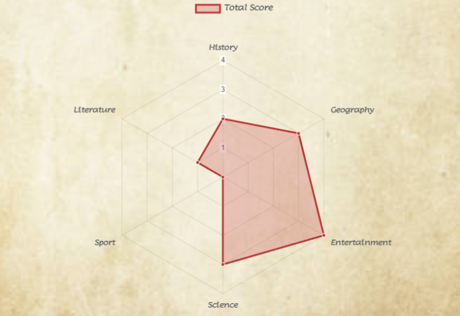

### Restart and quit buttons
The developer added a "quit quiz" button linking to the home page and a "restart quiz" button linking to the first question of the game.
The restart game button keeps the player in a loop, making it easier to restart the game.  
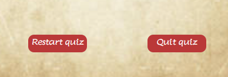


### Footer
The footer section links to the creator socials LinkedIn and Github and contains credits.


---
## Bugs fixing
  - #### Buttons positioning
     - **Bug:** Inconsistent spacing between the "Next" and "Exit" buttons on the question page, varying with different screen sizes.

     - **Cause:**  The buttons were part of a flexbox, and the gap was specified in pixels, causing spacing issues in different screen sizes.

     - **Fix:** Adjusted the gap space as a percentage in the CSS declaration to ensure consistent spacing.

 - ### The hourglass

      - **Bug:**  The developer added the gif of an hourglass to the question page to make it more eye-catching. Nevertheless, the size and positioning of the hourglass gif was inconsistent.
    
    - **Cause:** Positioning of the hourglass was set in CSS using pixel values, leading to discrepancies in positioning on various screen widths.

    - **Fix:** Improved positioning by using percentage values, but ultimately removed the hourglass as it did not synchronize with the timer and did not improve the page layout.

 - ### Footer positioning
    - **Bug:** The footer did not stick to the bottom, resulting in a white margin at the bottom on screens where the content did not fill the viewport height.

    - **Cause:** The background container was set to occupy 80% of the viewport height, causing the footer positioning issue.

    - **Fix:** Adjusted the background container to occupy 100% of the viewport height, resolving the bug.

- ### Questions not readable
    - **Bug:** The questions having the lengthiest text were not fully readable on large screens.

    - **Cause:** To improve readability on larger screens, the developer increased the font size too much, causing questions to have a width greater than their div container. Moreover, the questions overlapped with the answer div container.

    - **Fix:** On devices with a large screen width, the question font size is still increased compared to devices with a lower width, but the font size has been reduced compared to the previous version. The developer reduced the size of the questions and answers div on wider screens. 
    Moreover, he set an overflow-auto declaration on question div. Therefore, if the question text is too long on any device width, the user can scroll to read it.

- ### Question counter showing 31
   - **Bug:**  After replying to the last question, before moving to the result page, the question counter displayed 31 questions answered out of 30.

   - **Cause:** The function responsible for the next question was set to be activated if the question counter was less than or equal to the total question counter. Therefore, the counter was updated even if the total number of questions displayed was 30.

   * **Fix:** The function responsible for the next question now updates the counter only if the total number of questions displayed is lower than the value set to be the total number of questions.

- ### Radarplot not updating
  - **Bug:** The radar plot was showing a value of 0 for all categories, although the spans reporting the time and score were updated successfully.

  - **Cause:**  The variable `categories`, including the time and score for each category, when moved to the result page, gets the name of `storedCategory`, and the `categories` variable resets. The input variable for the radar plot function was `categories` rather than `storedCategories`.

  - **Fix:** Using `storedCategories` as input for the radar plot function solved the bug.

- ### Categories score being always 0
    - **Bug:**  The `categories` scores and time were always 0, although the user provided correct answers and took time before answering.

   - **Cause:** All variables reset after moving to a new HTML page. Therefore,  the `categories` variable also resets after the result page loads.

   - **Fix:** Creating a variable called `storedCategories`, which gets transferred to the result page, solved the bug.

- ### Local Variables
  - **Bug:** The time counter was showing as "nan",although all questions were displayed. The table reported a score value >0 only for one category. Furthermore, the time and score were both incorrect.

  - **Cause:** To improve code readability, the developer tried to set the timer and question variables as local variables. Thus, the `question` variable did not update at a higher scope. When the function `generateQuestion` generated a question in the load document event for the questions page, the `nextQuestion` function took as input a single value without updating. The same  happened for the time counter. The time counter was a local variable and therefore was not updating every second in the higher scope as expected.
  
  - **Fix:** Setting the timer and the question variable as global, fixed the issue.

- ### For loop
   - **Bug:**  The quiz could show the same question to the user several times, and the question counter showed values multiples of the total question length.

  - **Cause:** The problem arose from using a for loop that repeated itself regardless of a click event. Consequently, all the functions preceding the `nextQuestion` were executed, even when the user did not click the "Next" button. This behaviour was unintentional on the developer's part.

  - **Fix:** To rectify this issue, the developer moved the functions that were supposed to execute in the for loop to the click and keyboard event listeners. These event listeners handle the selection of a new question and the updating of the timer. This change ensures that the functions execute only when necessary, improving the user experience.
---
## Future developments
- Create an additional plot showing the score stats, likely a bar plot.

 - Add questions including pictures rather than only text.

 - Return a message describing the user profile based on the score: e.g. You are a dragon in Geography score {max score}. Your knowledge in History and Sport is not negligible either {>half-max score}, but you are a donkey in Literature {score 0}.
 ---

## Validators

- HTML
  - The W3C validator returned no error for .html files.
- CSS
  - The Jigsaw validator returned no error for .css files.
- JavaScript
  - The JSHint returned no error for .js files (Assume settings= Browser, jQuery,Development, New JavaScript features)
- Accessibility 
  - Lighthouse score for mobile devices
    - index.html  
     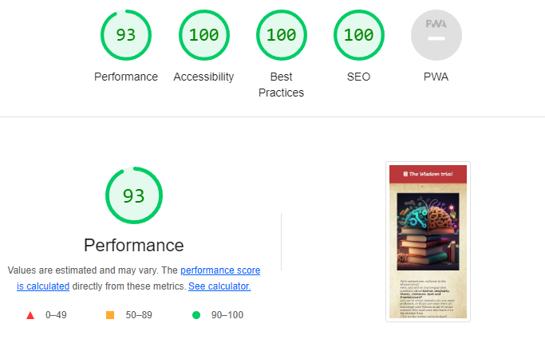
    - questions.html  
     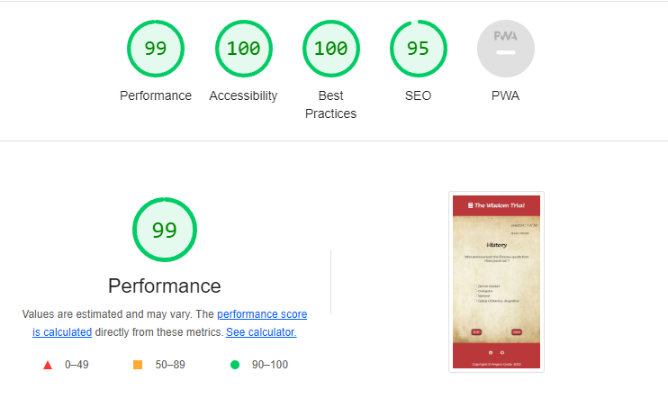
    - results.html  
     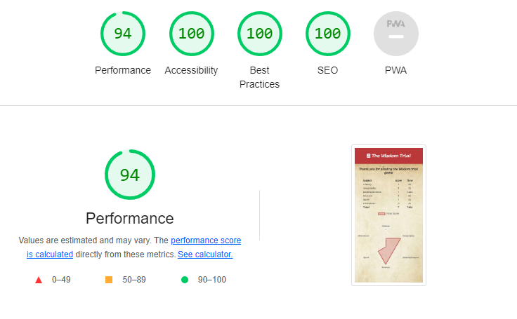
  - Lighthouse score for laptop devices
    - index.html  
  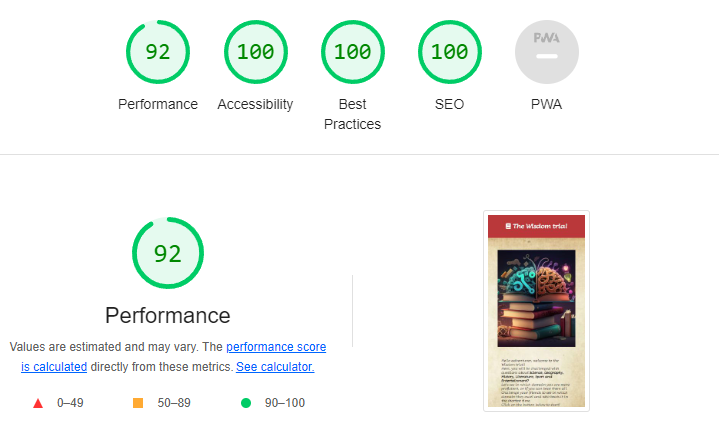
    - questions.html  
    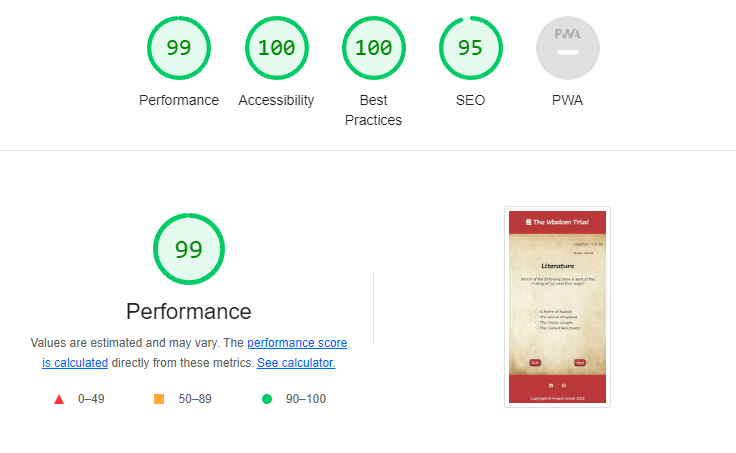
    - results.html  
    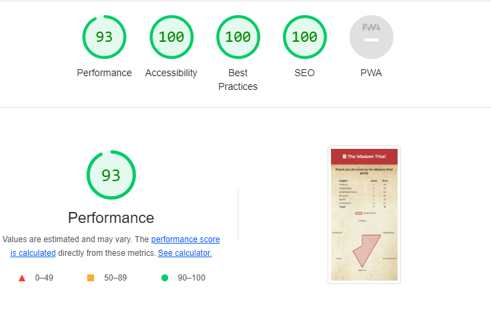

---
### Deployment
The website deploys to GitHub pages. 
To deploy the website, do as follows:
1. Select Setting on the repository menu
2. Select Pages in the menu on the right
3. Select Deploy from a branch
4. Select the main branch, then click on save 
5. [Live link to Wisdom trial](https://angelogaeta1990.github.io/knowledge-test/)

#### How to add questions and categories
  1. In file script.js, edit the questions objects:
  ```javascript
      id: 28,
      category: "Science",
      question: "What is the name of the process where a solid chages directly to the gas form?",
      answer1: "Sublimation",
      answer2: "Evaporation",
      answer3: "Condensation",
      answer4: "Melting",
      correctAnswer: "Sublimation",
      correctAnswerId: "option1",
  ```

2. The id represents the question number. 
Questions are listed from the first to the last, and their ID varies from 1 to 30. 
If the user wants to add a question, the new question ID must be 31. Otherwise, keep the question ID but change the other attributes of the object.

3. The category attribute represents the subject of the question. For example, the developer can change it by replacing the string "Science" with  "Biology".

4. Edit the question attribute with the new question and add the answers in the related field. Fill also the `corretAnswer` with the correct option. The `correctAnswerid`: has to be in the format "option{answer number}". Therefore, the accepted values are: "option1", "option2", "option3", and "option4". See point 1 to check the object structure.

5. Adjust the category variable accordingly in script.js
```javascript
let categories = [
    {
        name: "History",
        time: 0,
        score: 0,
    },
    ....
]
  ```
The developer can replace a category by changing the `name` attribute.
He can introduce a new category by adding a new object to the `categories` array and filling the attributes, setting `time` and `score` as 0

6.  In scripts.js, edit the following part of the code by setting max as the max score you can get in any category.
It sets the maximum value displayed in the radar plot:
```javascript
options: {
            scale: {
                ticks: {
                    beginAtZero: true,
                    // Max value in the radar plot
                    **max**: 5,
                    //Minimum Difference between values
                    stepSize: 1,
                },
                ...
            }
         ...   
}
```

7. Adjust the table element in results.html according to the new categories chosen.

## Testing 
 - The developer tested project in the following browser: Google Chrome, Edge, and Firefox, no issue has been observed.

 - The developer applied the mobile-first approach for this project and detected breakpoints by gradually increasing the screen width in Chrome dev tools and adding media queries where necessary.

 - The developer tested all buttons, and their functions met the expected behaviour.

 - The developer observed no graphical issue for questions and answers.
 They show without problems, regardless of the screen size tested.
---

## Credits 
 - OpenAI chatgpt has been used for debugging purposes.
 - Some questions have been generated with the aid of openAI chagpt.
 - The code was implemented using VS code.
 - The following library has been used to implement the radar plot:
 [JavaScript library](https://cdn.jsdelivr.net/npm/chart.js)
 - Images have been taken from the following websites:
   - Hero-image: [hero image link](https://www.freepik.com/free-photos-vectors/knowledge)
    - Favicon  [favicon link](https://www.flaticon.com/free-icon/book_207114)

