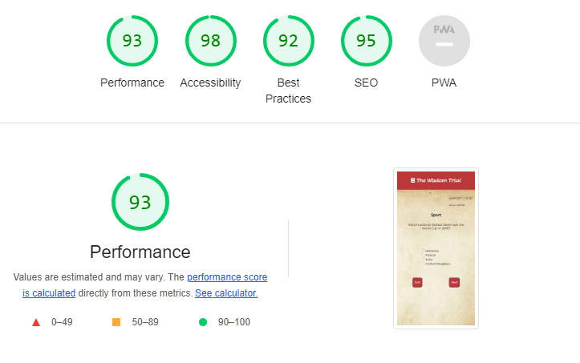

# The Wisdom Trial
---
## Site Overview
----
The Wisdom Trial is a general knowledge quiz. The main concept of this project revolves around the symbolism of books as a source of knowledge. On the homepage, a hero image depicts a pile of ancient books with a human brain atop it.

Both the font and the background are designed to evoke the style of old books, providing users with the sensation of reading an ancient tome.

Users will encounter a variety of questions related to different subjects, including Science, Geography, History, Literature, and Sports. Clicking the "next" button will reveal a new question, while clicking the "exit" button prompts a message asking if the user wishes to continue or leave the game.

At the end of the quiz, the results will be displayed in a table, and a radar plot will illustrate the user's proficiency in various subjects.

he JavaScript algorithm is robust and scalable. Questions can be easily added to the `questions.js` file, and categories can be modified or expanded by editing the `categories` variable in the `script.js` file. To enhance code readability, all questions have been moved to a separate JavaScript file named `questions.js`.

The website has been designed following the principles of mobile-first design. While its primary focus is on mobile devices, it scales seamlessly on various screen sizes, including mobiles (small, medium, and large), tablets, and laptops (medium, large, and 4k).

 

## Table of contents:
---
- [The Wisdom trial](#the-wisdom-trial)
    - [Site Overview](#site-overview)
- [Who is he user](#who-is-the-user)
    - [Aims](#aims)
    - [Goals achieved](#goals-achieved)
- [Typography](#typography)
- [Current Features](#current-features)
    - [Header element](#header-element)
    - [Hero image](#hero-image)
    - [Intro](#intro)
    - [Counters](#counters)
    - [Question](#question)
    - [Buttons](#buttons)
    - [Result table](#result-table)
    - [Radar Plot](#radar-plot)
- [Bugs Fixing](#bugs-fixing)
- [Next features](#next-features)
- [How to add questions and categories](#how-to-add-questions-and-categories)
- [Testing](#testing)
- [Validators score](#validators)
- [Deployment](#deployment)
- [Credits](#credits) 

## Who is the user
---
- Students who want to challenge themselves to determine their strong subjects.
- Adults who want to assess their knowledge in different subjects.
- Users seeking an entertaining quiz night with friends or during events.

### Aims
1. Create a quiz game for users to challenge themselves.
2. Develop a robust framework for quiz games that easily accommodates changes and additions to questions and categories.
3. Showcase users' strengths in various subjects.
4. Provide an enjoyable and user-friendly distraction.
---

### Goals achieved: 
1. Developed a quiz game with 30 questions divided into 6 categories.
2. Created a `questions.js` file for easy editing of questions and answers.
3. Displayed a table at the end of the game, showing the user's scores and time spent in each category, highlighting their strengths.
4. Designed the game to be playable on various screen sizes, including mobiles, tablets, and laptops.

### Typography 
---
- Imported fonts using Google Fonts.
- The chosen font is "Lumanosimo" to evoke the feeling of reading an ancient tome. Initially, "Medieval Sharp" was also considered, but "Lumanosimo" proved to be more visually appealing.

## Current Features
---
### Header Element
The header includes the title of the page, providing a way for users to return to the home page.

### Hero image
The hero image represents ancient tomes, which is the central concept of the project.

### Intro
A brief introduction informs users about the project's purpose and how to start the game. It also includes the "Start Game" button, initiating the game when clicked.

### Counters
The question page displays a counter showing the number of questions answered and the number of the remaining. It also features a timer that resets with each new question.

### Question
The question section presents the question category, the question itself, and a list of answer choices. Users can select the correct answer by clicking the radio button.

### Buttons
The buttons section includes two buttons: "Next" and "Exit." Users can move to the next question by clicking the "Next" button after selecting the correct answer via the radio button. Alternatively, pressing the Enter key on the keyboard after selecting an answer will also advance to the next question. Clicking the "Exit" button prompts a message asking if the user wants to continue the game or leave the page. Selecting "Yes" returns the user to the home page, while selecting "No" allows them to continue the game.

### Result table
The results table section thanks the player for participating in the game and displays the time (in seconds) and score obtained in each category. It also shows the total score and time.

### Radar Plot
The results page includes a radar plot that represents the user's scores in various subjects. To create the radar plot, the following library was used:
 [JavaScript library](https://cdn.jsdelivr.net/npm/chart.js)

### Footer
The footer section links to the creator socials LinkedIn and Github and contains credits.

---
## Bugs fixing
  - #### Buttons positioning
     - **Bug:** Inconsistent spacing between the "Next" and "Exit" buttons on the question page, varying with different screen sizes.

     - **Cause:**  The buttons were part of a flexbox, and the gap was specified in pixels, causing spacing issues in different screen sizes.

     - **Fix:** Adjusted the gap space as a percentage in the CSS declaration to ensure consistent spacing.

 - ### The hourglass

    - **Bug:** A giff of an hourglass was added to the question page to make it more eyecathing. Nevertheless, the size and positioning of the hourglass giff was inconsistent.
    
    - **Cause:** Positioning of the hourglass was set in CSS using pixel values, leading to discrepancies in positioning on various screen widths.

    - **Fix:** Improved positioning by using percentage values, but ultimately removed the hourglass as it did not syncronize with the timer and did not improve the page layout.

 - ### Footer positioning
    - **Bug:** The footer did not stick to the bottom, resulting in a white margin at the bottom on screens where the content did not fill the viewport height.

    - **Cause:** The background container was set to only occupy 80% of the viewport height, causing the footer positioning issue.

    - **Fix:** Adjusted the background container to occupy 100% of the viewport height, resolving the bug.

- ### Questions not readable
    - **Bug:** Especially on devices with a large screen width, the longest questions were not readable.

    - **Cause:** To improve readability on larger screens, the font size was increased too much, causing questions to have a width larger than their div container. Moreover, they were overlapping with the answer div container.

    - **Fix:** On devices with a large screen width, the question font size is still increased compared to devices with a lower width, but the font size has been reduced compared to the previous version. The size of the questions and answers div has been adjusted on larger devices, and on the question div, an overflow-auto declaration has been set. In this way, if the question text is too long on any device width, the user can scroll to read it.

- ### Question counter showing 31
   - **Bug:**  After replying to the last question, before moving to the result page, the question counter was showing 31 questions answered out of 30.

   - **Cause:** The function responsible for the next question was set to be activated if the question counter was less than or equal to the total question counter. Therefore, the counter was updated even if the total number of questions displayed was equal to 30.

   * **Fix:** The function responsible for the next question now updates the counter only if the total number of questions displayed is lower than the value set to be the total number of questions.

- ### Radarplot not updating
  - **Bug:** The radar plot was always showing a value of 0 for all categories, although the spans reporting the time and score were updated successfully.

  - **Cause:**  The variable `categories`, including the time and score for each category, when moved to the result page, gets the name of `storedCategory`, and the `categories` variable becomes undefined. The variable used as input for the radar plot function was set as `categories` rather than `storedCategories`.

  - **Fix:** Using `storedCategories` as input for the radar plot function solved the bug.

- ### Categories score being always 0
   - **Bug:**  The `categories` scores and time were always 0, although the user was providing correct answers and taking time before answering.

   - **Cause:** After moving to a new HTML page, all variables are reset. This was causing the `categories` variable to be reset after the result page was loaded.

   - **Fix:** Creating a variable called `storedCategories` that is passed to the result page solved the bug.

- ### Local Variables
  - **Bug:** The time counter was showing as "nan," although all questions were displayed, time and score were counted for only one category, and the time reported was incorrect.

  - **Cause:** In order to improve code readability, the developer tried to set the timer and question variables as local variables. This caused the question variable to be updated only in the local function. When a question was generated, only the category of the first question chosen was passed to the next functions. The same was happening for the time counter; being local, it was not updated every second as expected.
  
  - **Fix:** Setting the timer and question generated as global variables fixed the issue.

- ### For loop
  - **Bug:**  Questions that were already displayed appeared again, and the question counter showed values multiples of the total question length.

  - **Cause:** The problem arose from using a for loop that repeated itself regardless of a click event. Consequently, all the functions preceding the `nextQuestion` function executed, even when the user did not click the "Next" button. This behavior was unintentional on the developer's part.

  - **Fix:** To rectify this issue, the developer moved the functions that were supposed to execute in the for loop to the click and keyboard event listeners. These event listeners handle the selection of a new question and the updating of the timer. This change ensures that the functions execute only when necessary, improving the user experience.
---
## Next features
 - Create an addinional plot showing the score stats, likely a bar plot.

 - Add questions including pictures rather than only text.

 - Return a message describing the user profile based on the socre: e.g. Your are a dragon in geography score {max score} and your knowledge in history and sport are not bad either {>half-max score}, but you are a donkey in literature {score 0}

 ---
## How to add questions and categories
  1. In file script.js edit the questions objects:
      id: 28,
      category: "Science",
      question: "What is the name of the process where a solid chages directly to the gas form?",
      answer1: "Sublimation",
      answer2: "Evaporation",
      answer3: "Condensation",
      answer4: "Melting",
      correctAnswer: "Sublimation",
      correctAnswerId: "option1",
    
2. The id represents the question number,questions are listed from the first to the last, therefore their id varies from 1 to 30, if the user wants to add a question the new question id is 31, otherwise keep the question id but change the other attributes.

3. category respresent the question category, new category can be added by replacing "Science" with "Biology" for example.

4. Edit the question attribute with the new question and add the answers in the related field. Fill also the corretAnswer with the corret option and the correctAnswerid: has to be in the format "option{answer number}", therefore the accepted values are: "option1", "option2", "option3", "option4". see point 1 to check the object structure.

5. Adjust the category variable accordingly in script.js
let categories = [
    {
        name: "History",
        time: 0,
        score: 0,
    },
    ...
add the name of the category or edit an existing one, if you add a new category set its time and score to 0.

6.  In scripts.js edit the following part of code, by setting max as the max score you can get in any category.
It sets the maximum value of the catagories score dispalyed in the radarplot:
options: {
            scale: {
                ticks: {
                    beginAtZero: true,
                    // Max value in the radar plot
                    **max**: 5,
                    //Minimum Difference between values
                    stepSize: 1,
                },

7. Adjust the table element in results.html according to the new categories chosen.

## Testing 
 - The project has been tested in the following browser: Google chrome, Edge, and Firefox, no issue has been observed.

 - The project as been developed using a mobile first approach, and breakpoints have been detected by gradually increasing the the screen width in devtools and adding a media query where necessary.

 - All buttons have been tested, and their functions meets the expected behaviour.

 - No issue has been reported for questions and answers, they show without issue regardless of the screen size tested.
---
## Validators

- HTML
  - No error was returned when submitted to the W3C validator.
- CSS
  - No error was returned when submitted to the Jigsaw validator.
- Accessibility 

Lighthouse returns a score of 93 on question page.
---
### Deployment {#deployment}
The website was deployed to GitHub pages.The website has been deployes as follow:
1. Select Setting on the repository menu
2. Select Pages in the menu on the right
3. Select Deploy from a branch
4. Select main branch then click on save [Live link to Wisdom trial](https://angelogaeta1990.github.io/knowledge-test/)

---
## Credits 
 - OpenAI chatgpt has been used for debugging purposes.
 - The code was implemented using VS code.
 - The following library has been used to implement the radar plot:
 [JavaScript library](https://cdn.jsdelivr.net/npm/chart.js)
 - Images have been taken from the following websites:
   - Hero-image: [hero image link](https://www.freepik.com/free-photos-vectors/knowledge)
    - Favicon  [favicon link](https://www.flaticon.com/free-icon/book_207114)

