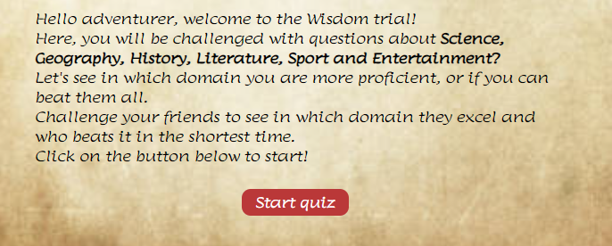

# The Wisdom Trial {#the-wisdom-trial}
---
## Site Overview {#site-overview}
----
The Wisdom trial is a general knowledge quiz.
The book which is the symbol of knowledge is main theme of the website.
The hero image at the home page of the website represents a pile of ancient books.

The font and the background also remind of an old books and gives the user the feeling of reading an ancient tome.

The user will need to answer to a variety of questions related to different subjects: Science, Geography, History, Literature and Sport.
By clicking on next a new question will be shown, whereas by by cliking on exit, a message will appear asking the user if he wishes to continue or to leave the game.
At the end of the quiz the results will be displayed in table and a radar plot will represent in which subjects the user was more proficient.

The Javascript algorithm  is robust and scalable, questions can be easily added in question.js file, and also the category can be easily changed/increased by editing the variable categories in the script.js file.
To improved code readbility all questions have been move to a separate JavaScript file, name questions.js.

The Website has been desgined to dipslay on different screen sizes: small, medium, and large mobile devices, tablets and medium, large and 4k laptops.

 

## Table of contents:
---
* [The Wisdom trial](#the-wisdom-trial)
    * [Site Overview](#site-overview)
* [Planning stage](#planning-stage)
    * [Site Aims](#site-aims)
    * [Aims methods](#aims-methods)
* [Typography](#typography)
* [Current Features](#current-features)
    * [Header element](#header-element)
    * [Hero image](#hero-image)
    * [Intro](#intro)
    * [Counters](#counters)
    * [Question](#question)
    * [Buttons](#buttons)
    * [Result table](#table)
    * [Radar Plot](#radar-plot)
* [Bugs Testing](#bugs-testing)
* [Next features](#next-features)
* [How to add questions and category](#how-to)
* [Validators score](#validators)
* [Credits](#credits) 

## Planning stage {#planning-stage}
---
* Students who want to challenge themselves to see in which subject they excel.
* Adults who wants to checks in whcih subjects they have the greater knowledge.
* Users who simply want to create a quiz night for friends or events (questions and category can be easily changed/added).

### Site Aims {#site-aims}
1. Create a quiz game user can use to challenge themselves.
2. Create a robust backbone for quiz games which can scales .easilty changing the questions and category.
3. Show the user in which subjects they excell the most.
4. Create s easy to use distraction for the user.
---

### Aims methods: {#aims-methods}
1. A quiz game has been create containing 30 questions divided into 6 categories
2. Questions.js is a separate file, including a JavaScript array of objects, where questions and answers can be easily added and edited.
3. At the of the game a table shows the score and the time spent for each category.
4. The game is playable on different screen sizes, allowing the use to play from mobile, tablet or laptop when ever he has time to spend.

### Typography {#typography}
---
* Fonts have been imported using google fonts
* Font chosen is Lumanosimo, to give the feedback of reading an ancient tome.
* Initially font Medieval Sharp was also included, but I noticed Lumanosimo only was more eye cathing.

## Current Features {#current-features}
---
### Header Element {#header-element}
The Header includes the title of the page which also bring the user back home, whenever he wants to.

### Hero image {#hero-image}
Hero image representic ancient tomes, main concepts of the project

### Intro {#intro}
Brief introcution to make the user aware of the aim of the project and provided info on how to start the game.
It also includes the start game button, by clicking on it the game starts

### Counters {#counters}
The question page shows a counter of the questions, telling the user how many questions have been replied and how many are left.
There is also a timer resetting at each new question.

### Question {#question}
The question section shows the category related to the question, the question itself and the list of answers.
The user can select the correct answer by clicking on the radio button

### Buttons {#buttons}
The buttons sections shows two buttons next and exit. 
The user can move to the next question by clicking on the Next button after selecting the correct answer.
The user can also press the enter button of the keyborad after selecting the answer in the radio buttons to move to the next question.
If the user clicks on the exit button, a message will appear asking the user if he wishes to continue the game, or leave the page.
If the user clicks on yes, he will be back to the home page, if the user clicks on no, the message will disappear and the user can continue the game.

### Result table {#table}
The results table section, thanks the player for having played the game and shows the time (in seconds) and the score obtained in each subject along with the total score and time

### Radar Plot {#radar-plot}
The results page shows also the radarplot, representing the score of the user, and in which subjecjs he got the highest scores.
To realize the radar plot, the following library has been used:
 [JavaScript library](https://cdn.jsdelivr.net/npm/chart.js)

### Footer {#footer}
The footer section links to the creator socials LinkedIn and Github and contains credits.

---
## Bugs testing
* media query were moving buttons and hourglass breaking the design in multiple occasion

* footer not sticking to the buttom

* Qestions text not readable

* Question counter reaching 30 + 1

* Plot not updating

* counter not updating

* only one category was shown
